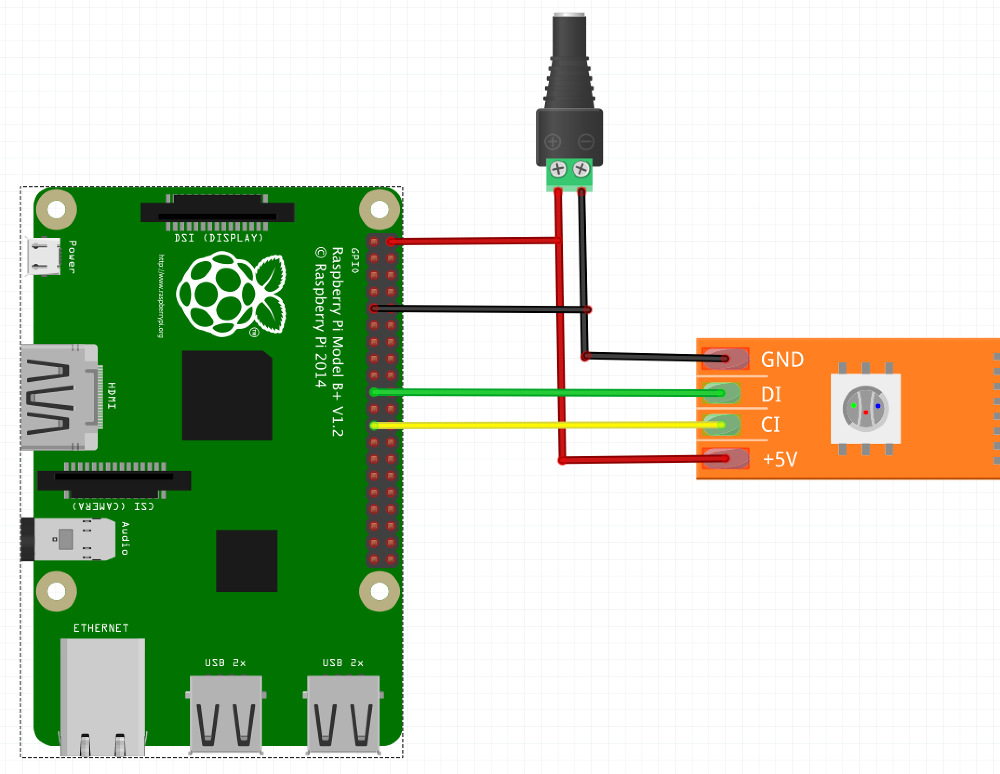

## Hello HOPE!
Welcome to my HOPE workshop on how to build an LED display similar to the one I have.
It uses a raspberry pi, which is kinda 'heavy-duty' for the task of controlling LEDs, but it lets us have nice things like the full power of python, hit apis, and host a webpage where we can control the leds easily. I'm interested in exploring more indirect human/computer interaction, so I built this in order to have some kind of passive display in my room. I'm excited to see what you'll do with it!

Feel free to work at your own pace here. There are a lot of steps because Pi's are complicated to setup


## Kit required:
- Raspberry pi zero W
- Power adaptor for it
- APA102 Leds that match the amount of power you have
    - (budget 60 milliamps per LED at full brightness, 20 miliamps for typical usage)
- MicroSD chip
- MicroSD adaptor
- Data-capable USB cable

We're loosely following this headless pi setup:

[https://medium.com/@aallan/setting-up-a-headless-raspberry-pi-zero-3ded0b83f274](https://medium.com/@aallan/setting-up-a-headless-raspberry-pi-zero-3ded0b83f274)

this may also be helpful

[https://hackernoon.com/raspberry-pi-headless-install-462ccabd75d0](https://hackernoon.com/raspberry-pi-headless-install-462ccabd75d0)

## Setup - Flashing the card

- Download latest version of raspbarian lite:
[https://www.raspberrypi.org/downloads/raspbian/](https://www.raspberrypi.org/downloads/raspbian/)

- write image to sd card
(I use the program etcher on osX)

## Setup - Editing the card
- mount sd card and edit some files!
    - add ssh file

     (don't add a wpa_supplicant at this point, we'll do that post boot. The reason is we want to boot and change the hostname to something unique, so everyone is sshing into their own pi)

    - The next two steps enable ethernet over usb on the pi

        - `config.txt`
            add `dtoverlay=dwc2` as last line

        -`cmdline.txt`
            replace contents with

        `dwc_otg.lpm_enable=0 console=serial0,115200 console=tty1 root=PARTUUID=4d3ee428-02 rootfstype=ext4 elevator=deadline fsck.repair=yes rootwait modules-load=dwc2,g_ether quiet init=/usr/lib/raspi-config/init_resize.sh


## Setup - Boot the Pi

- eject sd card
- insert into pi
- plug data usb into pi (middle port) and computer.
- wait 1 min for boot
- try to find pi on the network and ssh in. It ought to appear as a new ethernet connection on your computer.

        Here's some commands I found helpful to locate it
        (You may want to disconnect from the wifi to do this. The connection goes over the usb which emulates ethernet.
        If you don't disconnect from the wifi you may log into your neighbors raspberry pi.)

        `ping raspberrypi.local`
        `dns-sd -G v4 raspberrypi.local`

        You should be able to ssh into the pi, and get a shell on it. If that doesn't work, we can use nmap to find it and log in with the ip.
        When I did this, my pi had an IP of `169.254.221.175`.


        `ssh pi@raspberrypi.local`
        or
        `ssh pi@169.254.221.175` (whatever the IP address is)


        username: pi

        password: raspberry

        if it doesn't respond to ssh, maybe the ip address is wrong, or maybe you forgot to make a `ssh` file?

## Setup - Post-Login

You have a few tasks here:
There are two annoying text editors built in vi and nano. You can use either to edit these files. Once we edit them we'll enable wifi and you can download a better text editor.

- Change the hostname so it's different than your classmates.

Just something unique and simple. Replace this file
`sudo vi /etc/hostname`
also replace the hostname in this file with your new name
`sudo vi /etc/hosts`

- change the password (optional but wise)
`passwd`

- configure wireless if you haven't already, for convenience.
/etc/wpa_supplicant/wpa_supplicant.conf
(you need to use whatever the ssid and password of hopeconf is. I don't know yet. This is optional, you can continue using usb ethernet only for now, but you'll probably want to put it on the wifi when you install this at home or where-ever)
```
country=US
ctrl_interface=DIR=/var/run/wpa_supplicant GROUP=netdev
update_config=1
network={
       ssid="SSID"
       psk="PASSWORD"
       key_mgmt=WPA-PSK
    }
```

Then... REBOOT!
you should have a individually named raspberry pi on the wifi network now. Log in with your new hostname
make sure you can see google:
`ping www.google.com`

### Setup - install liteup  and dependencies

- install convenience packages

`sudo apt-get install vim`


or
`sudo apt-get install emacs`

Your preference - just don't tell me anything about which is your preference :-P


- install dependencies
`sudo apt-get install git`

- install berryconda - this is our python distribution
    (https://github.com/jjhelmus/berryconda). We will be using python 3.6
    ```
    wget https://github.com/jjhelmus/berryconda/releases/download/v2.0.0/Berryconda3-2.0.0-Linux-armv6l.sh
    chmod +x Berryconda3-2.0.0-Linux-armv6l.sh
    ./Berryconda3-2.0.0-Linux-armv6l.sh
    ```
- configure pi to use hardware spi
    `sudo raspi-config`, Interfacing Options, SPI, Enable

- install liteup https://github.com/mcscope/liteup
    - (optionally) fork the repo on github. This will allow you to publish your changes
    - either:
    `git clone https://github.com/mcscope/liteup.git`
    or
    `git clone https://github.com/<yourrepo>/liteup.git`

    The above lines are using the https versions for simplicity but if you want to do a lot of development and write your own patterns, it's worth making a fork and using the ssh versions and adding the ssh key so you can push without a password. If you don't know what this message means, you can ignore it and use https.

    `cd liteup`
    - Install liteup locally with pip, including dependencies. Scipy (needed for one of the schemes) only builds nicely with Conda

    `conda install scipy`

    `pip install -e .`

- edit config file - set the number of leds to the number you have.
- `cd liteup`
- run liteup for the first time

    `python client.py fullscan`
- run the server for the first time

    `python server/server.py`

- if the client and server are both running, you should be able to view the control panel and change the currently running scheme. To do this, visit `<yourpiname>.local:5000` in your browser.

- set liteup to auto-run
    - install the provided .service files so that the client and server will run on system start.
    This can be tricky

- editing on pi:
you can either use vim/emacs to edit on the pi, or if you are used to a visual text editor, you can use the `sshfs` program (needs to be installed) to mount the raspberry pi as a local drive.

- write your first scheme! you can open schemes/demo.py and start editing that scheme to get started.

## Setup: - WIRE IT UP:

Here's how we're going to wire the LED strip to the Pi:

The image shows a raspberry pi 3 but it should be the same for the zero. Double check the pinout just to be sure.
I should have a prebuilt model you can see.

I don't think I have headers in these kits so we'll solder right to the Raspberry Pi Zero boards.  I have some connectors that you may need to solder to the led strip if there aren't some already there.

- Power from the 5v pin to the strip +5V pad. (See note for 'larger arrays')
- Ground from one of the PI GND pins to the strip GND pad
- Clock from SCLK SPI Clock to CLK pad
- Data from MOSI (Master Out, Slave In) SPI pin to CI pad

## Troubleshooting:
    - LEDs are directional. There is a little arrow on the strip indicating the direction the data must flow.
    - If you didn't solder the strip connection yourself, cut back the heatshrink from the connection so you can see which wire goes to which pad. There are sometimes surprises underneath the heatshrink where they are soldered in a strange order.


#### Changes for larger arrays than the one we are building:

 - You should wire the power directly from the power supply to the strip, not through the pi first.

  I have an example of this. The PI cannot route too much power, not for more than a couple of meters of leds.

  You can power the pi from the power supply though, just don't hook the pi 5v to the strip 5v, or it may attempt to draw from the pi.

 - You want to supplement power and ground in every couple of meters, otherwise you will get noticable 'dimming' on the brighter colors. This looks like the leds getting redder as the strip continues, like a dying star.

 - still connect ALL grounds from the pi, power supply and strip

 - For Very Long strips, you may run into an issue with the data/clock single weakening as the strip goes on. I haven't found a good solution to this. You can try decreasing the clock rate, splitting the strip into several smaller ones, and maybe boosting the data/clock signal to 5v before it enters the strip, as it will come out of the pi at 3.3v

#### for 2d arrays and other shapes
 - You can cut the led strip along the 'cut line' between the pads, and rearrange it into whatever shape you want. You can also buy APA102 leds in a grid format
